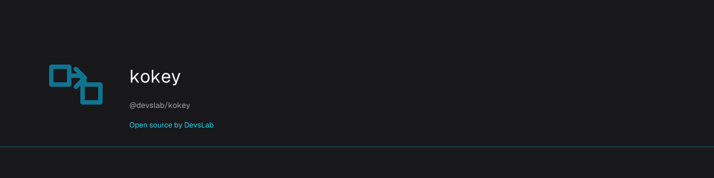

# kokey

<p align="center">
  <a href="https://devslab.kr/brand/open-source/"></a>
</p>

**Open source by [DevsLab](https://devslab.kr/)** · [OSS brand guide](https://devslab.kr/brand/open-source/) · Registry O05

[](https://www.npmjs.com/package/@devslab/kokey)
[](https://github.com/devslab-kr/kokey/actions/workflows/ci.yml)

[](./LICENSE)
[](https://stackblitz.com/github/devslab-kr/kokey/tree/main/examples/vanilla)

Конвертер раскладок клавиатуры — восстанавливает текст, набранный не в той
раскладке. TypeScript-first, **без зависимостей**, ESM/CJS.

[English](./README.md) · [한국어](./README.ko.md) · **Русский** · [Українська](./README.uk.md) · [עברית](./README.he.md) · [Ελληνικά](./README.el.md) · [ไทย](./README.th.md) · [العربية](./README.ar.md) · [ქართული](./README.ka.md)

Try it online: [⚡ StackBlitz — Vanilla](https://stackblitz.com/github/devslab-kr/kokey/tree/main/examples/vanilla) · [Vue](https://stackblitz.com/github/devslab-kr/kokey/tree/main/examples/vue) · [React](https://stackblitz.com/github/devslab-kr/kokey/tree/main/examples/react) · [Svelte](https://stackblitz.com/github/devslab-kr/kokey/tree/main/examples/svelte) · [Solid](https://stackblitz.com/github/devslab-kr/kokey/tree/main/examples/solid) | [📦 CodeSandbox](https://codesandbox.io/s/github/devslab-kr/kokey/tree/main/examples/vanilla)

Набирали `ghbdtn`, когда хотели написать `привет`? Забыли переключить
раскладку — и получили кириллическую кашу вместо пароля или артикула?
`kokey` преобразует «что набралось» в «что имелось в виду» — в обе стороны,
в точности по раскладке Windows ЙЦУКЕН: буква ё на клавише `` ` ``,
точка на `/`, запятая через Shift, `№` на Shift+3.

## Установка

```sh
npm install @devslab/kokey
```

## Использование

```ts
import { ruToEn, enToRu } from '@devslab/kokey/ru'

ruToEn('привет')   // 'ghbdtn'
enToRu('ghbdtn')   // 'привет'
enToRu('Vjcrdf')   // 'Москва' — регистр учитывается
```

Автоопределение письменности (смешанный текст тоже работает):

```ts
import { register, toEn } from '@devslab/kokey'
import { ru } from '@devslab/kokey/ru'

register(ru)
toEn('привет hello 123')  // 'ghbdtn hello 123'
```

Русская и украинская раскладки различаются автоматически: `привіт`
распознаётся как украинский (буква і), `привет` — как русский.

## DOM: поле, которое чинит себя само

```html
<input data-kokey="ru">  <!-- латинские нажатия становятся русским текстом -->
<input data-kokey="en">  <!-- любая зарегистрированная письменность → QWERTY -->
```

```ts
import { observe, register } from '@devslab/kokey'
import { ru } from '@devslab/kokey/ru'

register(ru)
observe()
```

## Vue / React / Svelte / Solid

```vue
<KokeyInput v-model="value" mode="ru" />
```

```tsx
<KokeyInput mode="en" value={v} onChange={(e) => setV(e.target.value)} />
```

Компонент выполняет преобразование внутри потока данных фреймворка, поэтому
`v-model` / controlled-инпуты всегда получают уже преобразованное значение.

В Svelte и Solid — действие/директива `use:kokey` (`@devslab/kokey/svelte`, `/solid`):

```svelte
<input use:kokey={'ru'} />
```

## Полная документация

Полное описание API (все раскладки, `defineLayout`, хуки, директивы) —
в [английском README](./README.md).

## Лицензия

[MIT](./LICENSE) © devslab
